[Task Reference](https://observant-hydrangea-9c1.notion.site/Git-Self-Practice-Exercise-2beaf9a188408003863bfeab8fb0f9c9)

# 1. Merge Conflicts

When two branches edit the same part of a file, git doesn't know which change to keep.
Creating and Resolving a merge conflict

### **Step 1: Create file and do a sample commit**

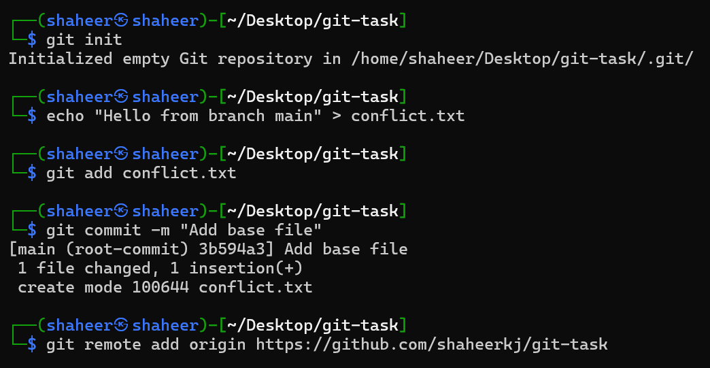

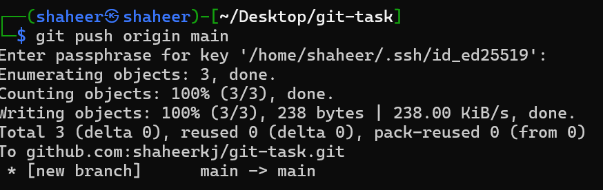

###  **Create a new branch:**

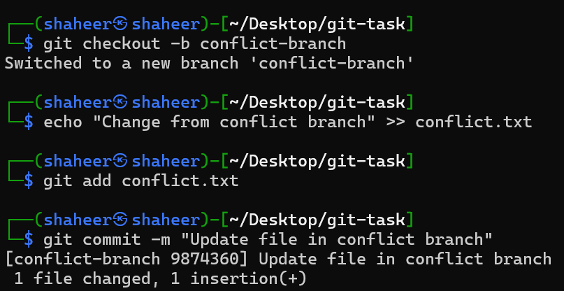
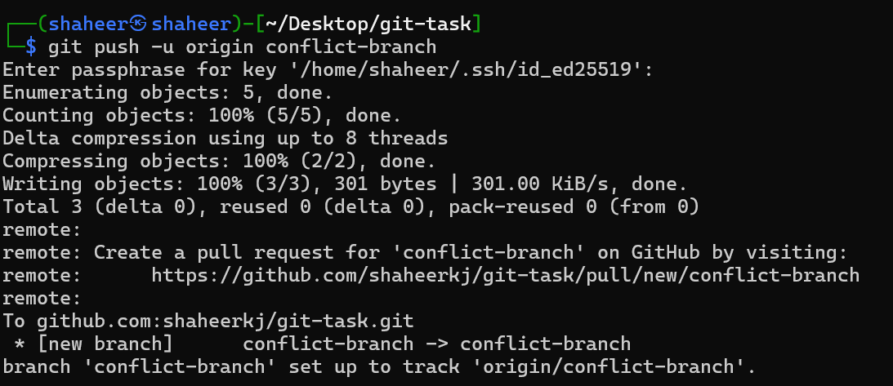

### **Edit the same file in main:**

### **Merging the two branches:**

Causes a merge conflict:
Both branches have added entry in the same part of the file, so git doesn't know which file we want to keep the changes of:

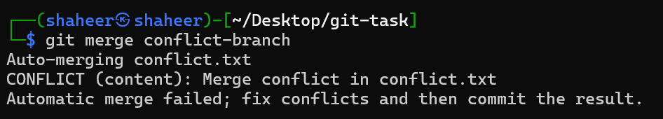

### **opening and editing using vim:**

We manually edit the file using vim and remove the conflict by ensuring the insertions are on different parts of the file:

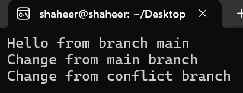

### **Merging after resolving conflict:**

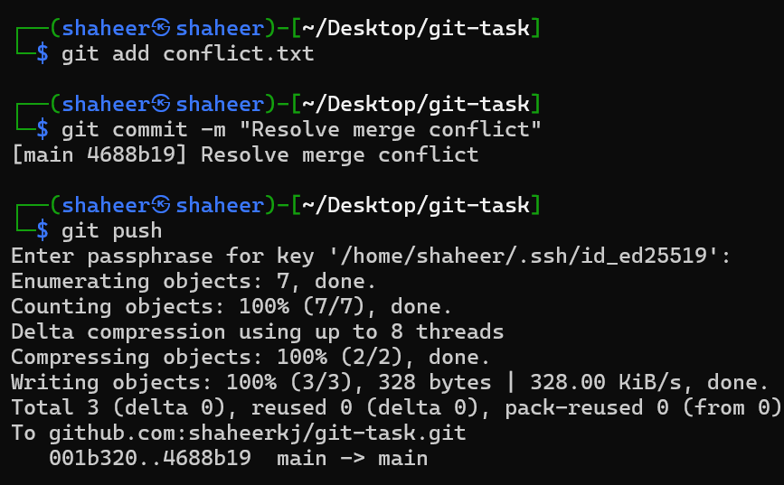

# Branching Strategy

Why branches? Branches let you work on features separately without touching the main code.

### **Create 3 branches:**

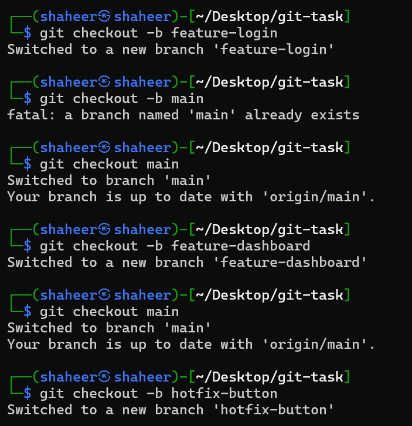

### **Making a new branch and Adding & committing file:**

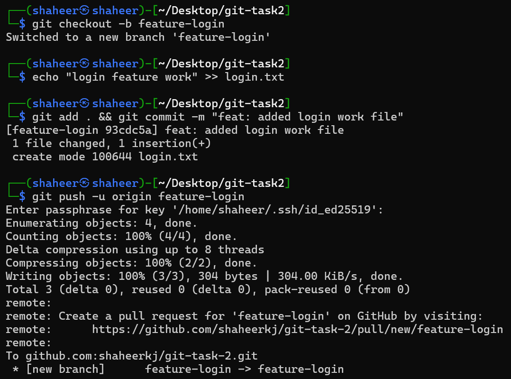

# Git Rebase:

**What is a rebase?**

Rebase = **moving your branch to start from the latest version of main**.
Exercise: simple rebase

### **Create a new branch

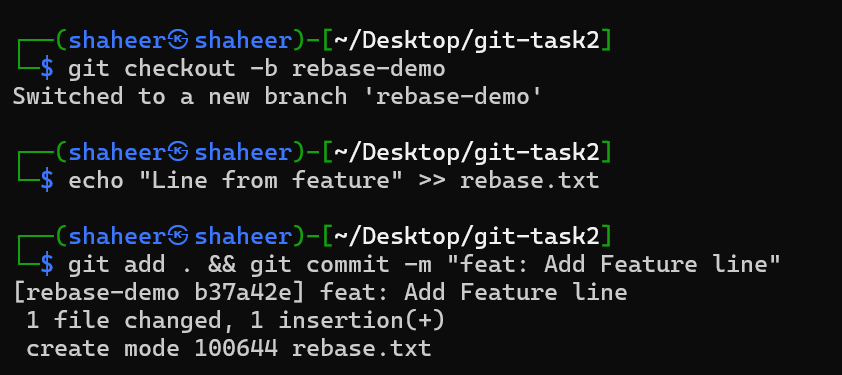

### **Go back to main, add insertion and rebase:**

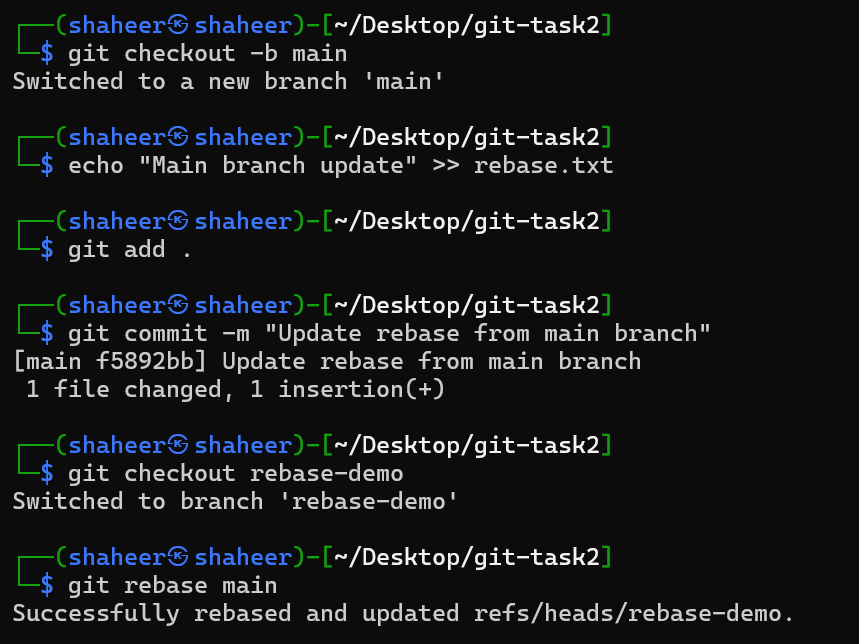

