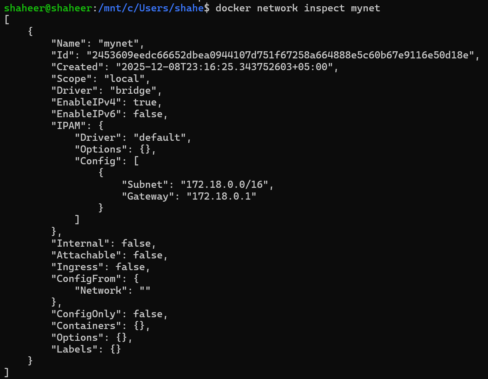
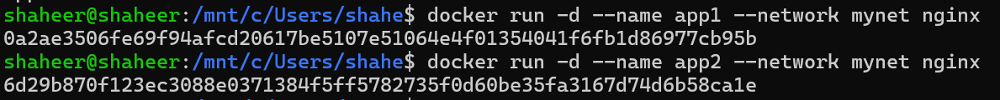
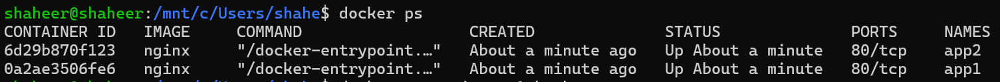

Task
```markdown
make a network in docker
pull and deploy nginx image in 2 containers inside the network
inside from a container, ping the other container and make sure you get a reply
```

### Pulling nginx image and making a network:

```bash
# Pulls the latest nginx image by default
docker pull nginx

# Making a network
docker network create mynet

# Since we didn't specify a network type, bridge is selected by default.
```

### Inspecting the network

```bash
# Lists the networks
docker network ls

# Inspect one network
docker network inspect mynet
```



### Types of networks in docker:

- Bridge (Default):
	- Containers are connected to a virtual bridge (a software switch) that allows them to communicate with each other. Containers on the bridge network can communicate with the host through a NAT (Network Address Translation).
	- This is basically the NAT version of how we define network settings in Virtual Machines
- Host:
	- Shared network with the Host
	- Just like how we define bridged network in our virtual machines
- None:
	- The **none** network mode disables networking completely for the container. This means the container won’t be able to access external networks or communicate with other containers.
	- **Use case**: Used when the container is not supposed to have any network connectivity, such as when running isolated applications.
- Container network:
	- **Shared network namespace between containers**: This allows one container to share the network namespace of another container. This means they share the same IP address and can communicate via `localhost`.
	- **Use case**: Used when you want containers to directly share networking, such as a web application container that needs to access a database container using `localhost`.


### Running our nginx containers inside the network:

Running 2 containers, `app1` & `app2` inside our `mynet` network using the nginx image we pulled.




### Getting interactive shell in one container:

```bash
# gets interactive shell inside app1 container
docker exec -it app1 bash
```

Pinging app2 from app1 shell & receiving a reply.

